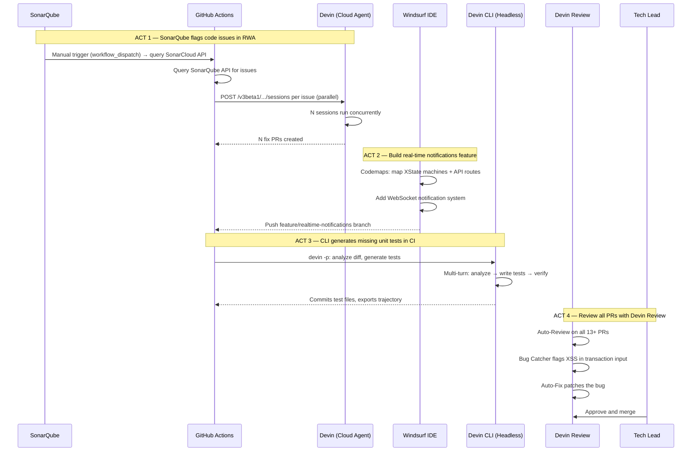
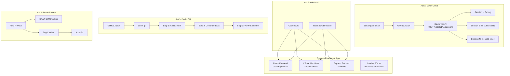

# Cognition Product Suite — End-to-End Demo Flow

## Repository: COG-GTM/cypress-realworld-app

---

## Overview

This demo showcases four Cognition products working together on a single repository — the Cypress Real World App (RWA), a full-stack Venmo-like payment application built with React, TypeScript, Express, and XState.

**The narrative arc:** _Detect → Fix → Build → Test → Review → Merge_

| Act | Product          | Task                                           | Unique Capability                                                   |
| --- | ---------------- | ---------------------------------------------- | ------------------------------------------------------------------- |
| 1   | **Devin**        | Remediate SonarQube code issues in parallel    | Cloud agent, API-driven, parallel sessions, idempotent              |
| 2   | **Windsurf**     | Add WebSocket real-time notifications          | Codemaps for XState architecture, IDE-native creative work          |
| 3   | **Devin CLI**    | Generate missing unit tests for the feature PR | Headless CI agent, multi-turn `--continue`, `--export` audit trail  |
| 4   | **Devin Review** | Review all 13+ PRs, catch XSS bug, auto-fix    | Smart diff grouping, Bug Catcher, Auto-Fix, `REVIEW.md` conventions |

**One-liner:** _"SonarQube flagged the issues. Devin fixed them all in parallel overnight. Windsurf built a new feature. The CLI wrote the tests. Devin Review caught a bug the human missed. All on one repo, all in one day."_

---

## Prerequisites

### Repo Secrets

Add these in **Settings > Secrets and variables > Actions** on the `COG-GTM/cypress-realworld-app` repo:

| Secret Name                | Source                                                                         | Used By                        |
| -------------------------- | ------------------------------------------------------------------------------ | ------------------------------ |
| `DEVIN_SERVICE_USER_TOKEN` | Service user token (`cog_...`) with ManageOrgSessions + ImpersonateOrgSessions | Act 1: Devin v3 API            |
| `SONAR_TOKEN`              | SonarQube / SonarCloud project token                                           | Act 1: SonarQube API           |
| `WINDSURF_API_KEY`         | Devin CLI auth (`apk_user_...` token)                                          | Act 3: Devin CLI headless mode |

### Files to Add to the Repo

| File                                            | Purpose                                           |
| ----------------------------------------------- | ------------------------------------------------- |
| `.github/workflows/devin-sonar-remediation.yml` | Act 1: SonarQube scan → Devin API                 |
| `.github/scripts/delegate_sonar_issues.py`      | Act 1: Query SonarQube API, create Devin sessions |
| `.github/workflows/devin-cli-tests.yml`         | Act 3: Headless test generation                   |
| `REVIEW.md`                                     | Act 4: RWA-specific review guidelines             |
| `.windsurfrules`                                | Act 2: Windsurf project conventions               |

### Devin Review Settings

- Enable **Auto-Review** at [Settings > Review](https://app.devin.ai/settings/review) for the repo
- Enable **Auto-Fix** at [Settings > Customization](https://app.devin.ai/customization) > Pull request settings

---

## Sequence Diagram



---

## ACT 1: Devin — SonarQube Issue Remediation at Scale

### The Scenario

The RWA codebase is connected to SonarQube (or SonarCloud). A scan surfaces code smells, bugs, vulnerabilities, and security hotspots across the TypeScript and Express backend. A GitHub Action queries the SonarQube API for open issues and delegates each one to Devin as a parallel session — no human intervention required.

### Why RWA Is Perfect

The app is a full-stack TypeScript project with React, Express, and XState — exactly the kind of codebase where SonarQube finds real issues: complexity hotspots in state machines, security concerns in API routes, type-safety gaps, and code smells in components. This isn't a contrived scenario — it's real maintenance work.

### Setup

#### `.github/workflows/devin-sonar-remediation.yml`

```yaml
name: SonarQube Remediation via Devin
on:
  workflow_dispatch: # Manual trigger — click "Run workflow" in GitHub Actions

jobs:
  remediate:
    runs-on: ubuntu-latest
    steps:
      - uses: actions/checkout@v4

      - name: Install Python dependencies
        run: pip install aiohttp

      - name: Query SonarQube and delegate to Devin
        env:
          DEVIN_SERVICE_USER_TOKEN: ${{ secrets.DEVIN_SERVICE_USER_TOKEN }}
          DEVIN_ORG_ID: "org-928b443b74fd45aaacfa7bab73bc2c2d"
          SONAR_TOKEN: ${{ secrets.SONAR_TOKEN }}
          SONAR_HOST_URL: "https://sonarcloud.io"
          SONAR_PROJECT_KEY: "mbatchelor81_cypress-realworld-app"
        run: python3 .github/scripts/delegate_sonar_issues.py
```

#### `.github/scripts/delegate_sonar_issues.py`

```python
#!/usr/bin/env python3
"""
Query SonarQube for open issues and create one Devin session per issue.
Each session gets a prompt to fix the issue, run tests, and open a PR.
"""

import json
import os
import asyncio
import aiohttp

DEVIN_SERVICE_USER_TOKEN = os.environ["DEVIN_SERVICE_USER_TOKEN"]
DEVIN_ORG_ID = os.environ["DEVIN_ORG_ID"]
SONAR_TOKEN = os.environ["SONAR_TOKEN"]
SONAR_HOST_URL = os.environ["SONAR_HOST_URL"].rstrip("/")
SONAR_PROJECT_KEY = os.environ.get("SONAR_PROJECT_KEY", "mbatchelor81_cypress-realworld-app")

DEVIN_API_URL = f"https://api.devin.ai/v3beta1/organizations/{DEVIN_ORG_ID}/sessions"
SONAR_ISSUES_URL = f"{SONAR_HOST_URL}/api/issues/search"

CREATE_AS_USER_ID = "email|68c322be31ab500694e66453"
REPO = "mbatchelor81/cypress-realworld-app"

MAX_CONCURRENT_SESSIONS = 20

DEVIN_HEADERS = {
    "Authorization": f"Bearer {DEVIN_SERVICE_USER_TOKEN}",
    "Content-Type": "application/json",
}


def fetch_sonar_issues():
    """Fetch all open issues from SonarQube API with pagination."""
    import urllib.request
    import base64

    credentials = base64.b64encode(f"{SONAR_TOKEN}:".encode()).decode()
    all_issues = []
    page = 1
    page_size = 100

    while True:
        params = (
            f"?componentKeys={SONAR_PROJECT_KEY}"
            f"&statuses=OPEN,CONFIRMED,REOPENED"
            f"&types=VULNERABILITY"
            f"&severities=CRITICAL,BLOCKER"
            f"&ps={page_size}"
            f"&p={page}"
        )
        req = urllib.request.Request(
            SONAR_ISSUES_URL + params,
            headers={"Authorization": f"Basic {credentials}"},
        )
        try:
            with urllib.request.urlopen(req) as resp:
                data = json.loads(resp.read())
        except urllib.error.HTTPError as e:
            body = e.read().decode(errors="replace")
            raise SystemExit(
                f"SonarQube API error (HTTP {e.code}): {body}"
            )

        issues = data.get("issues", [])
        all_issues.extend(issues)

        total = data.get("total", 0)
        if len(all_issues) >= total or not issues:
            break
        page += 1

    return {"issues": all_issues, "total": len(all_issues)}


async def create_devin_session(session, semaphore, issue):
    """Create a Devin session for a single SonarQube issue."""
    rule = issue.get("rule", "unknown")
    severity = issue.get("severity", "MAJOR")
    message = issue.get("message", "No description")
    component = issue.get("component", "").replace(f"{SONAR_PROJECT_KEY}:", "")
    line = issue.get("line", "unknown")
    issue_type = issue.get("type", "CODE_SMELL")
    issue_key = issue.get("key", "unknown")

    prompt = (
        f"SonarQube Issue Remediation\n\n"
        f"Issue Key: {issue_key}\n"
        f"Rule: {rule}\n"
        f"Type: {issue_type}\n"
        f"Severity: {severity}\n"
        f"File: {component}\n"
        f"Line: {line}\n"
        f"Message: {message}\n\n"
        f"Instructions:\n"
        f"1. Open `{component}` and fix the issue described above at/near line {line}\n"
        f"2. Follow the SonarQube rule guidance for {rule}\n"
        f"3. Run `npm test` and `npm run lint` to verify nothing breaks\n"
        f"4. If tests fail, fix any regressions caused by the change\n"
        f"5. Create a PR with the title: 'fix({issue_type.lower()}): resolve {severity.lower()} SonarQube issue in {component}'\n"
    )

    title = f"sonar-{issue_key}: {severity.lower()} {issue_type.lower()} in {component}"
    data = {
        "prompt": prompt,
        "create_as_user_id": CREATE_AS_USER_ID,
        "repos": [REPO],
        "title": title,
        "tags": ["sonarqube", issue_key],
    }

    async with semaphore:
        async with session.post(DEVIN_API_URL, headers=DEVIN_HEADERS, json=data) as resp:
            result = await resp.json()
            status = "created" if resp.status in (200, 201) else "failed"
            print(f"[{status}] {component}:{line} ({severity} {issue_type}): {result.get('session_id', 'N/A')}")
            return result


async def main():
    print(f"Querying SonarQube at {SONAR_HOST_URL} for project {SONAR_PROJECT_KEY}...")
    data = fetch_sonar_issues()
    issues = data.get("issues", [])

    if not issues:
        print("No issues found. Exiting.")
        return

    print(f"Found {len(issues)} issues. Creating Devin sessions...")

    semaphore = asyncio.Semaphore(MAX_CONCURRENT_SESSIONS)
    async with aiohttp.ClientSession() as session:
        tasks = [create_devin_session(session, semaphore, issue) for issue in issues]
        await asyncio.gather(*tasks)

    print("All sessions created.")


if __name__ == "__main__":
    asyncio.run(main())
```

### Demo Talking Points

- "SonarQube flagged critical vulnerabilities. Devin spun up a parallel session for each one — all fixed while the team was asleep"
- "Using the v3 Service User API, sessions are created on behalf of a team member — fully auditable and org-scoped"
- "This is the SonarQube → Devin API pipeline. SonarQube is the scanner your enterprise already uses — Devin is the remediation engine"
- "One click on 'Run workflow' and Devin handles the rest — repeatable every time you demo"

### Key Features Highlighted

- **Parallel execution**: Each SonarQube issue spawns its own Devin session via the API, rate-limited to 20 concurrent sessions
- **v3 Service User API**: Sessions created via org-scoped endpoint with `create_as_user_id` for impersonation and audit trail
- **Manual trigger**: `workflow_dispatch` means you control exactly when it runs — perfect for repeatable demos
- **Enterprise scanner integration**: Works with SonarQube, SonarCloud, or any tool with an API
- **Scheduled sessions**: Can also be configured with a cron trigger or the Devin Schedules API for production use

---

## ACT 2: Windsurf — Build Real-Time Notifications with Codemaps

### The Scenario

The RWA has a notification system (`src/components/NotificationsList.tsx`, `src/machines/notificationsMachine.ts`) but it's polling-based. You'll use Windsurf to add WebSocket-based real-time notifications — a meaningful feature that touches the full stack.

### Why RWA Is Perfect

The app already has XState machines for transactions, authentication, and notifications. Adding WebSocket support is a natural extension that demonstrates Codemaps' ability to map complex state management patterns.

### Live Demo Steps

#### Step 1: Codemaps — Understand the Architecture

1. Open the repo in Windsurf
2. Use **Codemaps mode** (AskDevin > Codemaps) with the prompt:

   > "Show me how the notification system works end-to-end: from the API route to the XState machine to the React component"

3. Codemaps will visualize the flow:
   - `backend/notification-routes.ts` → `src/machines/notificationsMachine.ts` → `src/components/NotificationsList.tsx`

#### Step 2: Build the Feature

Using Windsurf's context-aware editing:

1. Add a WebSocket server to `backend/app.ts` (using `ws` or `socket.io`)
2. Modify `notificationsMachine.ts` to listen for WebSocket events instead of polling
3. Update `NotificationsList.tsx` to show real-time badge counts

#### Step 3: Add Project Conventions

Create `.windsurfrules` in the repo root:

```
# Cypress Real World App — Windsurf Rules

## TypeScript
- Use strict mode
- No `any` types — use proper interfaces

## State Management
- All state management uses XState machines in `src/machines/`
- Follow existing machine patterns (context, events, states, services)

## Testing
- All new components must have unit tests
- E2E tests go in `cypress/tests/`
- Unit tests use Jest + React Testing Library

## API
- API routes follow RESTful conventions in `backend/`
- Database access goes through `backend/database.ts`
- All endpoints must validate input
```

#### Step 4: Push and Open PR

```bash
git checkout -b feature/realtime-notifications
git add -A
git commit -m "feat: add WebSocket-based real-time notifications"
git push origin feature/realtime-notifications
# Open PR on GitHub
```

### Demo Talking Points

- "Before writing a single line, I used Codemaps to understand how notifications flow through 3 layers: API → state machine → component"
- "Windsurf is the right tool here because this is creative, architectural work — I need to see the full picture and iterate in real time"
- "Notice how Windsurf understood the XState machine pattern and generated the WebSocket event handler in the same style"

### Key Features Highlighted

- **Codemaps**: Structural analysis showing how modules connect across the full stack
- **Context-aware editing**: Windsurf understands the repo structure while you code
- **Skills/rules support**: `.windsurfrules` ensures the AI follows team conventions
- **Interactive development**: Real-time collaboration with the AI in your IDE

---

## ACT 3: Devin CLI — Headless Test Generation in CI

### The Scenario

The feature PR from Act 2 adds new WebSocket code but no unit tests. The Devin CLI runs headless in CI to analyze the diff, generate tests, and commit them — all without a human or a browser.

### Why RWA Is Perfect

The app has extensive Cypress E2E tests but sparse unit tests for individual components and state machines. The CLI can generate Jest/RTL tests for the new WebSocket notification components, filling a real gap.

### Setup

#### `.github/workflows/devin-cli-tests.yml`

```yaml
name: Devin CLI — Auto-generate Tests
on:
  pull_request:
    types: [opened, synchronize]

jobs:
  generate-tests:
    runs-on: ubuntu-latest
    steps:
      - uses: actions/checkout@v4
        with:
          fetch-depth: 0
          ref: ${{ github.head_ref }}

      - name: Install Devin CLI
        run: curl -fsSL https://static.devin.ai/cli-insiders-d029bf81/install.sh | bash

      - name: Authenticate Devin CLI
        run: |
          mkdir -p ~/.local/share/cognition
          echo "windsurf_api_key = \"${{ secrets.WINDSURF_API_KEY }}\"" \
            > ~/.local/share/cognition/credentials.toml

      - name: Step 1 — Analyze changed files
        run: |
          CHANGED=$(git diff --name-only origin/main...HEAD -- '*.ts' '*.tsx')
          devin -p --permission-mode dangerous \
            --export /tmp/analysis.json \
            -- "These files changed in this PR: $CHANGED. 
                Analyze each file and identify which functions/components 
                lack unit test coverage. List them."

      - name: Step 2 — Generate tests
        run: |
          devin -p --permission-mode dangerous \
            --continue \
            --export /tmp/tests.json \
            -- "Now write unit tests for each uncovered function you identified.
                Follow the existing test patterns in cypress/tests/ and src/__tests__/.
                Use Jest and React Testing Library. Place tests next to source files."

      - name: Step 3 — Verify tests pass
        run: |
          devin -p --permission-mode dangerous \
            --continue \
            -- "Run 'npx jest --passWithNoTests' to verify all tests pass. 
                If any fail, fix them."

      - name: Commit generated tests
        run: |
          git config user.name "Devin CLI"
          git config user.email "devin-cli@ci"
          git add -A
          git diff --cached --quiet || git commit -m "test: auto-generate unit tests for PR changes"
          git push
```

### Demo Talking Points

- "The CLI isn't reviewing code — it's _writing_ code. It analyzed the diff, generated test files, ran them, and committed the results"
- "Three turns, one session context. The CLI remembered what it analyzed in step 1 when writing tests in step 2"
- "The `--export` flag captured the full trajectory — every tool call, every file read, every test run — for audit"
- "Devin runs in the cloud. Windsurf runs in your IDE. The CLI runs _everywhere else_ — your CI pipeline, your Docker container, your cron job"

### Key Features Highlighted

- **Headless execution**: No browser, no IDE — runs in CI as a pipeline step
- **Multi-turn `--continue`**: Maintains context across 3 steps (analyze → generate → verify)
- **`--export`**: Full trajectory saved to JSON for audit/compliance
- **`--permission-mode dangerous`**: The agent reads, writes, and executes — not just reviews
- **Containerizable**: Same workflow can run inside Docker for sandboxed execution

### CLI Differentiators vs. Other Products

| Capability          | Devin (Cloud) | Windsurf (IDE)    | Devin CLI          |
| ------------------- | ------------- | ----------------- | ------------------ |
| Runs in CI/CD       | No            | No                | Yes                |
| Runs in containers  | No            | No                | Yes                |
| Multi-turn stateful | N/A           | Yes (interactive) | Yes (`--continue`) |
| Audit trail export  | Session logs  | No                | `--export` JSON    |
| No UI required      | API only      | Requires IDE      | Fully headless     |

---

## ACT 4: Devin Review — Review Everything

### The Scenario

You now have 12+ CVE fix PRs from Act 1, a feature PR from Act 2 (with auto-generated tests from Act 3). Devin Review processes all of them automatically.

### Setup

#### Enable Auto-Review

Go to [Settings > Review](https://app.devin.ai/settings/review) and enable auto-review for the repo. Auto-review triggers when:

- A PR is opened (non-draft)
- New commits are pushed to a PR
- A draft PR is marked as ready for review
- An enrolled user is added as a reviewer or assignee

#### Enable Auto-Fix

Go to [Settings > Customization](https://app.devin.ai/customization) > Pull request settings > Autofix settings.

#### Add `REVIEW.md`

Create `REVIEW.md` in the repo root:

```markdown
# Review Guidelines for Cypress Real World App

## Architecture

- All state management uses XState machines in `src/machines/`
- API routes follow RESTful conventions in `backend/`
- Database access goes through `backend/database.ts`

## Security Requirements

- Transaction amounts must be sanitized (XSS prevention)
- All API endpoints must validate input with express-validator
- User-generated content (transaction descriptions, comments) must be escaped

## Testing Requirements

- All new components must have unit tests
- XState machines must have test coverage for all states/transitions
- No direct DOM manipulation — use React patterns

## Code Style

- TypeScript strict mode — no `any` types
- Follow existing patterns in the codebase
- Use functional components with hooks
```

### Live Demo Steps

1. **Open the feature PR** (Act 2's WebSocket notifications) in Devin Review
2. **Show Smart Diff Organization**: Devin Review groups the backend WebSocket changes, the XState machine changes, and the React component changes into logical sections — not alphabetical file order
3. **Show Bug Catcher**: Point out findings — e.g., a potential XSS vulnerability in the transaction comment field (the RWA handles user-generated content in transaction descriptions)
   - Severe bugs: high-confidence issues requiring immediate attention
   - Flags: informational annotations for investigation
4. **Show Auto-Fix**: Devin proposes a sanitization fix (e.g., adding `DOMPurify`) for the flagged XSS issue, applicable directly from the diff view
5. **Show Codebase-Aware Chat**: Ask "Does this WebSocket implementation handle reconnection on network failure?" and get an answer with context from the XState machine
6. **Show GitHub Compatibility**: Comments, approvals, and change requests sync bidirectionally with GitHub
7. **Approve and merge**

### Demo Talking Points

- "13 PRs landed today. Without Devin Review, that's 13 review sessions for the tech lead. With it, the bugs are already flagged and the fixes are ready"
- "Notice how it grouped the 3 notification-related files together even though they're in different directories"
- "The Bug Catcher found an unsanitized transaction comment — and Auto-Fix already has the `DOMPurify` patch ready to apply"
- "The `REVIEW.md` file taught Devin Review our project's security requirements — that's why it flagged the XSS issue"

### Key Features Highlighted

- **Smart diff organization**: Groups related changes logically
- **Copy and move detection**: Shows when code was moved, not deleted+inserted
- **Bug Catcher**: Severity levels (severe vs. non-severe) and flags (investigate vs. informational)
- **Auto-Fix**: Proposes code fixes applicable from the diff view
- **Codebase-aware chat**: Ask questions with full repo context
- **REVIEW.md / instruction files**: Custom review guidelines respected by the reviewer
- **GitHub compatibility**: Bidirectional sync of comments, approvals, change requests

---

## Full Demo Script (Timing Guide)

| Segment | Act          | What to Show                                                                                                                  | Key Moment                                                                    |
| ------- | ------------ | ----------------------------------------------------------------------------------------------------------------------------- | ----------------------------------------------------------------------------- |
| Opening | —            | Show the RWA app running locally, explain the tech stack                                                                      | "This is a real app with real dependencies and real code quality issues"      |
| Act 1   | Devin        | Click "Run workflow" in GitHub Actions, show SonarQube dashboard, then Devin sessions spinning up in parallel on app.devin.ai | "One click — SonarQube issues delegated, Devin sessions running"              |
| Act 2   | Windsurf     | Live-code the WebSocket feature using Codemaps                                                                                | "Codemaps mapped the notification flow across 3 layers before I wrote a line" |
| Act 3   | Devin CLI    | Show the CI workflow running, the 3-step multi-turn conversation, the committed tests                                         | "The CLI wrote tests, ran them, and committed — all headless in CI"           |
| Act 4   | Devin Review | Walk through the review UI: smart diffs, Bug Catcher findings, Auto-Fix                                                       | "It caught an XSS bug and already has the fix ready"                          |
| Close   | —            | Show all PRs merged, the app running with the new feature                                                                     | "Detect, fix, build, test, review, merge — one repo, one day, four products"  |

---

## Architecture Diagram



---

## Appendix: Optional Enhancements

### Scheduled Sessions (Act 1 Extension)

Set up a recurring Devin session via the Schedules API to run SonarQube scans every Monday:

```bash
curl -X POST https://api.devin.ai/v3beta1/organizations/{org_id}/schedules \
  -H "Authorization: Bearer $DEVIN_SERVICE_USER_TOKEN" \
  -H "Content-Type: application/json" \
  -d '{
    "prompt": "Query SonarQube for open issues on cypress-realworld-app. For each critical/major issue found, fix it, run tests, and create a PR.",
    "cron": "0 6 * * 1",
    "timezone": "America/New_York"
  }'
```

### Container-Based CLI (Act 3 Extension)

Run the CLI in a sandboxed Docker container for enterprise security requirements:

```dockerfile
FROM debian:bookworm-slim
RUN apt-get update && apt-get install -y curl python3 git nodejs npm
RUN curl -fsSL https://static.devin.ai/cli-insiders-d029bf81/install.sh | bash
```

```bash
docker run --rm \
  -e WINDSURF_API_KEY=$WINDSURF_API_KEY \
  -v $(pwd):/workspace -w /workspace \
  my-devin-cli-image \
  devin -p --permission-mode dangerous \
  -- "Generate unit tests for all changed files"
```

### npm audit Integration (Act 1 Alternative)

Replace SonarQube with `npm audit` for a lighter-weight dependency-only scan. Parse the JSON output and delegate each CVE to Devin the same way. Useful when you only need to remediate known dependency vulnerabilities rather than full static analysis.
